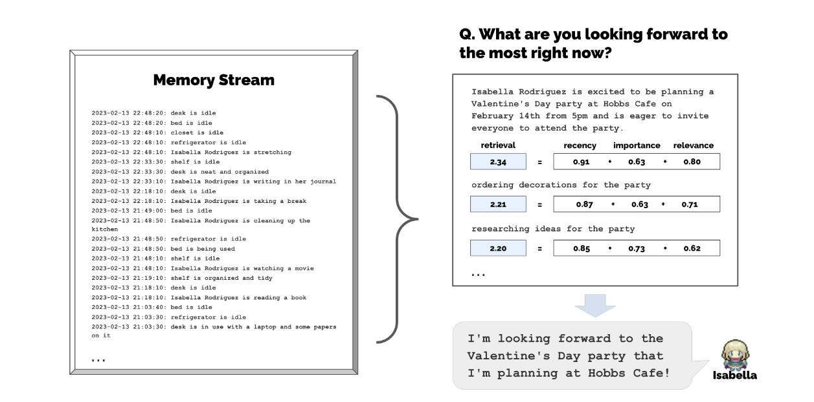
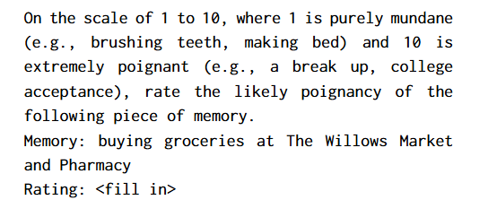
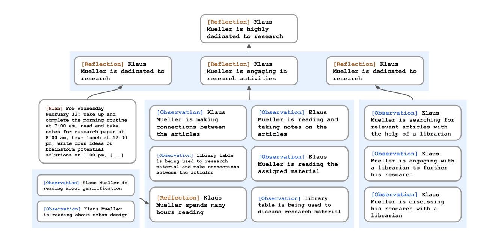

# Generative Agents: Interactive Simulacra of Human Behavior

## Three Key Point: Memory Stream, reflection, planing

### Memory Stream
A long-term memory module that records, in natural language, a
comprehensive list of the agent’s experiences.

The retrieval function scores all memories as a weighted
combination of the three elements.(all $\alpha$ s are set to 1)
$$score = \alpha_{recency} \cdot recency + \alpha_{relevance} \cdot relevance + \alpha_{importance} \cdot importance $$

- relevance

Relevance assigns a higher score to memory objects that are
related to the current situation.

In our implementation, we use the language model
to generate an embedding vector of the text description of each
memory. Then, we calculate relevance as the cosine similarity be-
tween the memory’s embedding vector and the query memory’s
embedding vector.
- recency

Recency assigns a higher score to memory objects that were re-
cently accessed. Our decay factor is 0.995.

- importance

Importance distinguishes mundane from core memories by as-
signing a higher score to memory objects that the agent believes to
be important. Directly ask the language model to output an integer
score is effective. The full prompt appears below:

### Reflection

1. Ask Question 

Determine what to reflect on by identifying questions that can be asked given the agent’s recent experiences. 

We query the large language model with the 100 most recent records in the agent’s memory stream and prompt the language model, “Given only the information above, what are 3 most salient high-level questions we can answer about the subjects in the statements?”

2. Find relevant records

prompt the language model to extract insights and cite the
particular records that served as evidence for the insights.

3. Add to Memory Stream

parse and store the statement as a reflection in the memory stream,including pointers to the memory objects that were cited

### Planning and Reacting
Agents need to plan over a longer time horizon to ensure that their sequence of actions is **coherent and believable**. 
1. Creating a initial plan
2. recursing a detailed plan
3. Reacting and Updating Plans
4. Dialogue