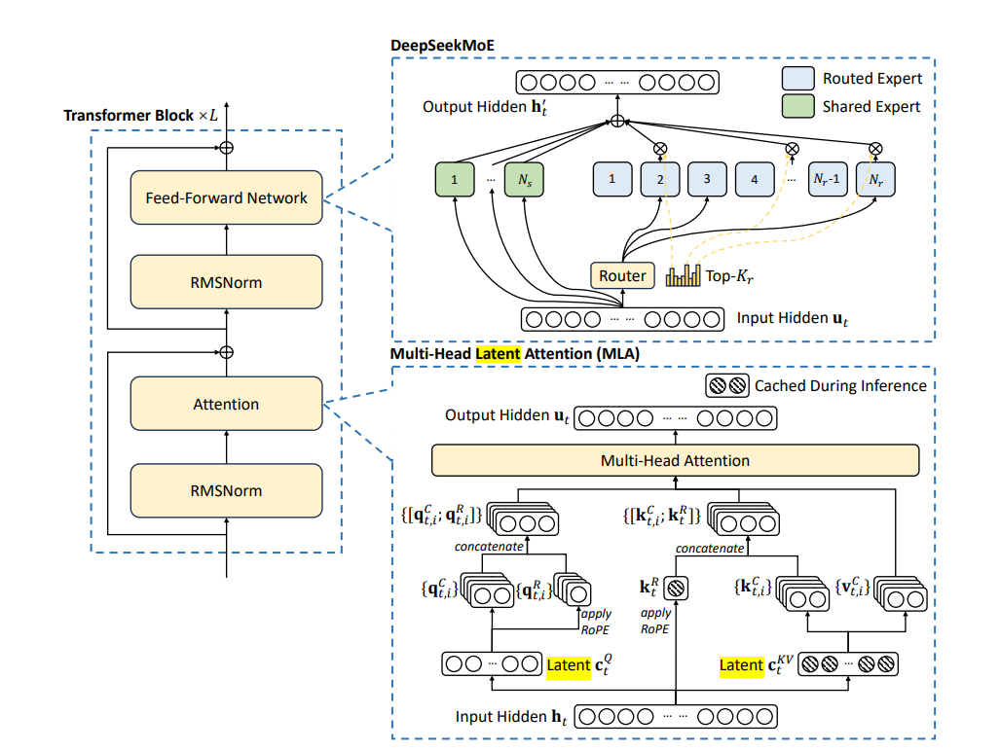
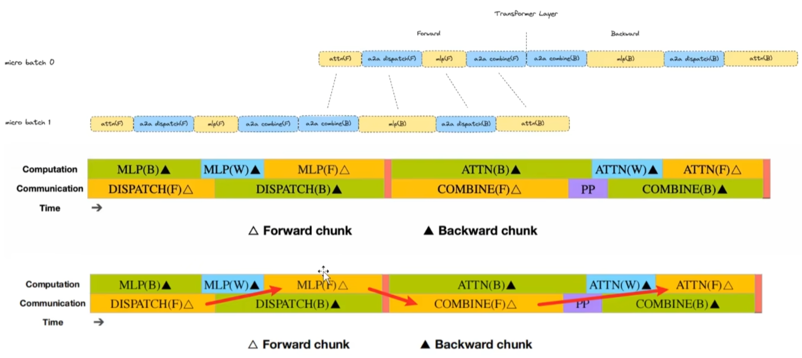
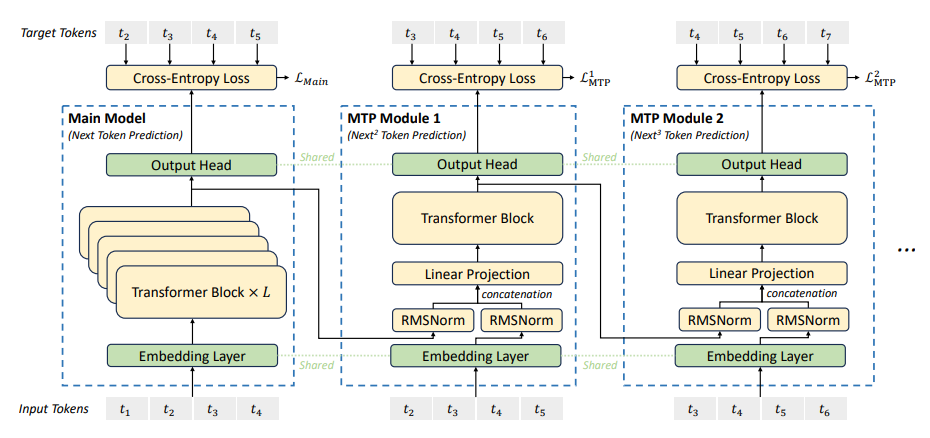
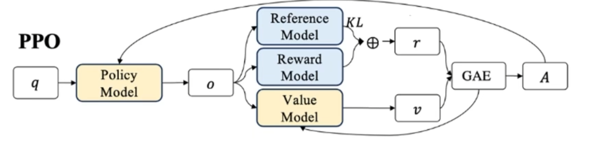
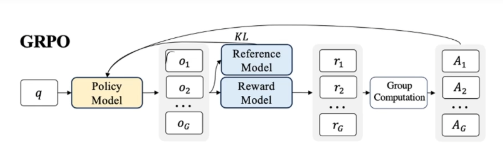
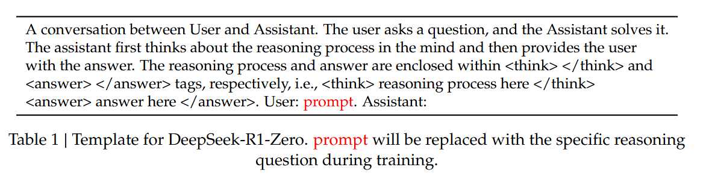
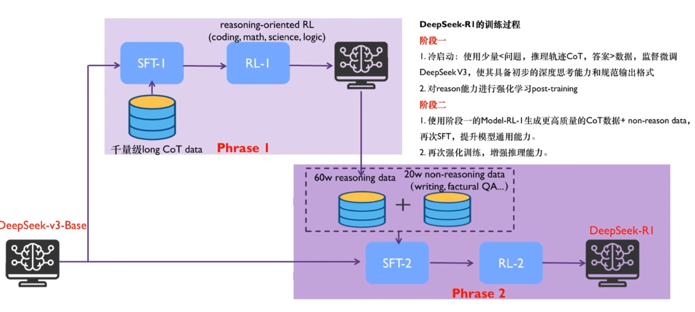

# Model Structure

## 1. Load Balancing Strategy(MoE)
- high-load experts

The high-load experts are detected based on statistics collected during the online deployment and are adjusted periodically (e.g., every 10 minutes)

- redundant experts(dynamic)

Redundant experts are copys of high-load experts. In every GPU(total 32), except for 8 experts, there is a redundant expert to make sure every GPU is processing similar amount of token.

## 2. Multi-head Latent Attention
The core of MLA is the low-rank joint compression for attention keys and values to reduce Key-Value (KV) cache during inference.

## 3. Pipeline Parallelism
### MoE Parallelism
- **computational and communication tasks**

In this parallelism strategy, while one GPU is executing computational tasks (such as the forward pass, backpropagation, or any other computation), it can simultaneously receive data from another GPU.



## 4. Multi_token Prediction

When input is t2, t3, t4, t5,  the model will predict t6 and t7 simutaneously.



# Training Strategy

## 5. Reinforce Learning

### a. Using GRPO replace PPO

Classic ChatGPT: Pre-Training + SFT + RLHF(PPO + Reward Model: Learn human preference)

O1: PRM, CoT

1. Why do we need RL?

SFT can not provide negative feedback;

SFT lack of understanding of backward aapabilities;

SFT responses in token level, whereas RLHF (Reinforcement Learning with Human Feedback) gives responses at a much broader level, treating the entire text as a whole.

2. Types of RL

PPO ChatGPT(Best)

DPO LLama(Fastest)

GRPO Deepseek(Cheapest)


3. Reward in RL

Rewards during training(PRM: Per-Token Reward Mechanism)
- Advantage: It allows fine-grained correction and optimization at every step

- Disadvantage: requires a lot of attention to the reward signal, which can sometimes lead to "reward hacking" 

Rewards based on the final result(ORM: Overall Result-based Reward Mechanism)
- Advantages: It only requires the final outcome to be standardized and doesn't focus on every token. This simplifies the process and avoids the issues seen with token-based rewards.
- Disadvantages: The reward assignment can become somewhat imprecise or blurry, making it harder to provide nuanced corrections during training.

4. Reward in Deepseek
- Accurancy reward
- Format reward(CoT)

### b. New studying process
#### Deepseek-r1-zero
Deepseek-r1-zero: without supervised fine tunning, only using the reinforcelearning and reward model based on rules, the model can generate a CoT with reflection(反思)

input: sys_msg + question


- **No Fine-Tuning (SFT) Required**: Deepseek-r1-zero proved that  only processing reinforcelearning on the base model, the model can achieve a strong reasoning ability.

- **Multiple Sampling Strategy**: By sampling multiple responses for a single prompt and selecting the most frequently occurring answer, the model's performance can be further improved.

- **Self-Improvement with Training Steps**: As training progresses, the "r1 zero" model tends to generate longer responses (such as detailed "chain-of-thought" reasoning) and even starts showing **reflective** behavior. This suggests that the model improves itself during training without external intervention.

- **Longer Responses Reflect Deeper Thought**: As training continues, the responses become longer, indicating that the model is "thinking" more deeply or reasoning in more detail.

#### Deepseek-r1


Stage 1: train a model to generate data for stage 2

Stage 2: train a model for all scenarios

1. Stage 1:Cold Start(on SFT)
- few shot: using long CoT as example in prompt
- tell the model to reflect and varify the answer in prompt
- collect part of the result in Deepseek-r1-zero
- post-processing by human
- follow the format(Due to the shortcome of r1-zero is that the output format may be not readable for users, in r1, the output should follow the format to flitter the unneccessary information by only showing the user <summary>)
```
|special token|<reasoning_processing>special|<summary>|
```

2. Stage 1: Reasoning-oriented Reinforcement Learning
- a language consistency reward during RL training(overcome the shortcome of r1-zero)
- reward the result

3. Stage 2: Rejection Sampling and Supervised Fine-Tuning

this stage incorporates data from other domains to enhance the
model’s capabilities in writing, role-playing, and other general-purpose tasks
- Reasoning data: 

rejection sampling from the checkpoint from the above RL training to filtered out chain-of-thought with mixed languages, long parapraphs, and code block

- Non-Reasoning data:

For certain non-reasoning tasks, we call DeepSeek-V3 to generate a potential chain-of-thought before answering the question by prompting. However, for simpler queries, such as “hello” we do not provide a CoT in response

4. Stage 2: Reinforcement Learning for all Scenarios

Using a combination of reward signals and diverse prompt distributions.
- Reasoning data
- General data
- Helpfulness
- Harmlessness

### c. New dissertion
Using the data generated by deepseek-r1 to sft small model can significantly improve the reasoning ability.

For distilled models, we apply only SFT and do not include an RL stage.