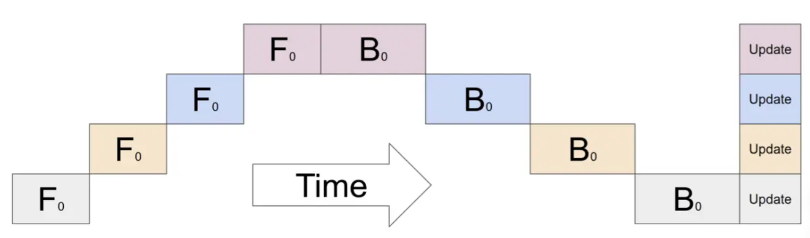
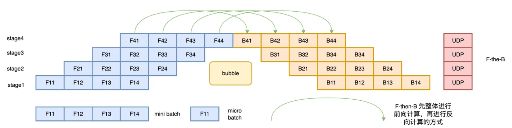
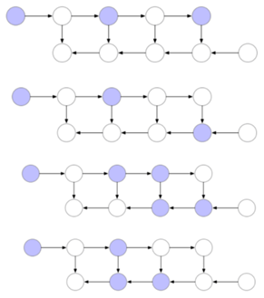
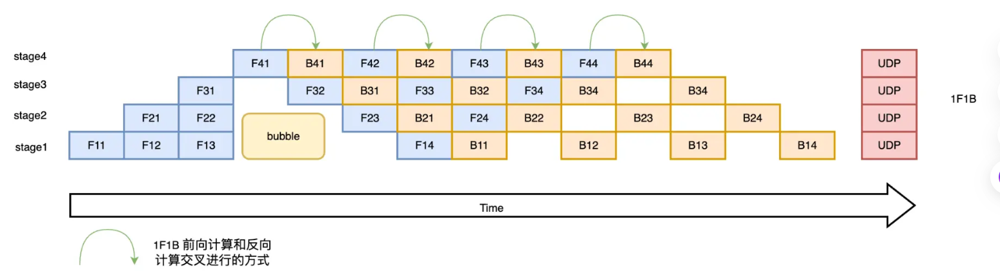

# Pipeline Parallelism

## 1. Defination
A technique used to distribute model training across **multiple GPUs** (or machines) by splitting the model into different stages.

## 2. Key Points

1. **Model Partitioning:** The model is divided into sequential "stages," with **each stage assigned to a different GPU**. For example, if a model has 12 layers and 4 GPUs, each GPU might get 3 layers.

2. **Micro-batches:** Instead of processing a single batch at a time, the input batch is split into **smaller micro-batches**, which move through the pipeline sequentially.

3. **Pipeline Execution:** The first GPU processes the first micro-batch and passes the intermediate output to the next GPU. While the **second GPU is processing the first micro-batch**, the **first GPU starts processing the second micro-batch**. This overlapping execution increases GPU utilization.

4. **Forward and Backward Pass:** The same pipeline is used **during the backward pass**, ensuring gradients are passed correctly between the GPUs.

5. **Gradient Synchronization(同步):** After the backward pass, gradients are accumulated, and optimization happens collectively across all GPUs.

## 3. Development

- **Naive**

- **F-then-B**

Multiple micro batch **intermediate variables and gradients are cached**, and the actual **utilization of video memory is low**

**Improvement:  gradient checkpoint**

Purple points is checkpoints that need to cached, white points are checkpoints that need to forget during the forward pass.

In the backward pass, caculating the white points using the cached purple point above the white point.

In other words, using computation time to exchange for more memory space.

- **1F1B**

In the backward pass, separate each micro-batch. After the micro backward pass, release the memory.

- **Deepseek MoE Parrelism**

