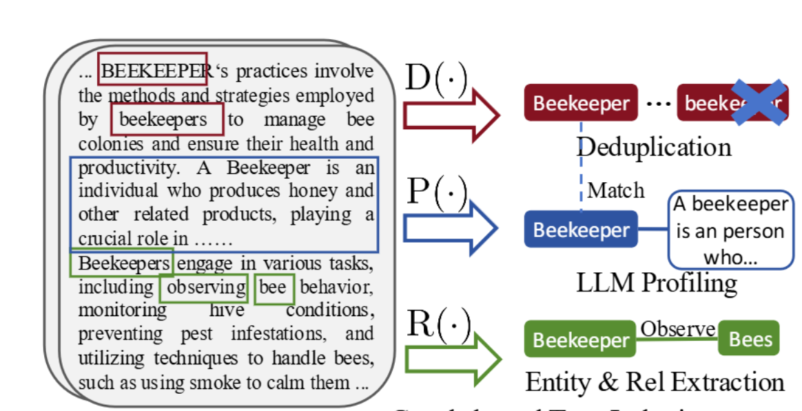
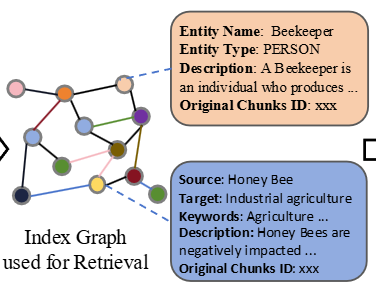
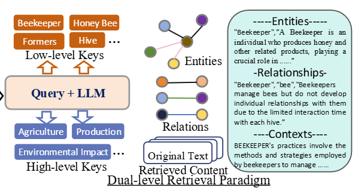

## RAG
### Light RAG

`D(.)` : Deduplication

`P(.)` : Profiling

`R(.)` : Relationship Extraction

Entities and relationships are stored in a graph structure for fast and semantically rich retrieval.

Nodes = concepts/entities, edges = relations

Given a **user query**, the system retrieves both:

- **Low-Level Keys**: Directly mentioned terms (e.g., Beekeeper, Honey Bee, Hive).

- **High-Level Keys**: LLM-generated abstract concepts (e.g., Agriculture, Production, Environmental Impact).